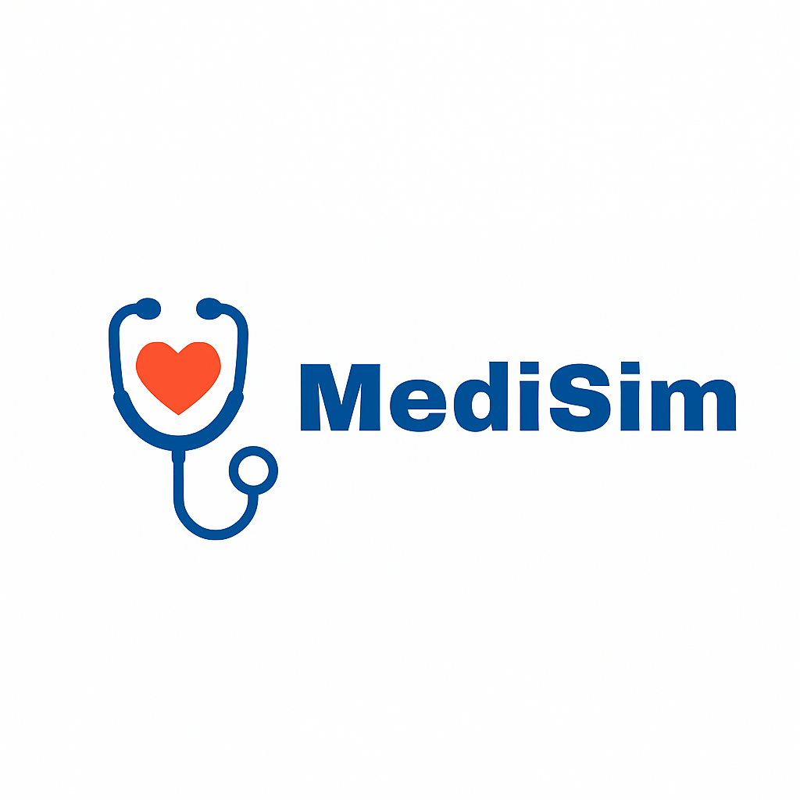

<body>

<!-- HEADER GÖRSELLERİ -->

<!-- TEAM & PRODUCT NAME -->
<h1><b>Team & Product Name</b></h1>
<h3><b>MediSim</b></h3>

<!-- TEAM MEMBERS TABLE -->
<h2>Information About Team and Product</h2>

<h3>Team Members</h3>
<table>
  <tr>
    <th></th>
    <th>Name</th>
    <th>Title</th>
    <th>Socials</th>
  </tr>

  <!-- Örnek Üye -->
  <tr>
    <td></td>
    <td>Elif Kartal</td>
    <td>Developer</td>
    <td>
      
      
    </td>
  </tr>

  <tr>
    <td></td>
    <td>Emirhan Toprak</td>
    <td>Scrum Master</td>
    <td>
      
      
    </td>
  </tr>

  <tr>
    <td></td>
    <td>Ömer Biltekin</td>
    <td>Developer</td>
    <td>
      
      
    </td>
  </tr>

  <tr>
    <td></td>
    <td>Şevval Demir</td>
    <td>Product Owner</td>
    <td>
      
      
    </td>
  </tr>

  <tr>
    <td></td>
    <td>Umut Sönmez</td>
    <td>Developer</td>
    <td>
      
      
    </td>
  </tr>

  <!-- Diğer ekip üyelerini buraya ekleyebilirsin -->

</table>

<!-- PRODUCT DESCRIPTION -->
<h2>Product Description</h2>

MediSim, tıp öğrencileri için geliştirilen yapay zeka destekli, web tabanlı bir hasta simülasyon platformudur. 
Öğrenciler, sanal hastalar ile etkileşime geçerek vaka analizi yapabilir, teşhis koyabilir ve klinik pratiğe hazırlanabilir. 
LLM teknolojisi ile desteklenen sistem, gerçekçi diyalog ve semptom aktarımı sunar.

<!-- PRODUCT FEATURES -->

<h2>Product Features</h2>

<h3>Virtual Patient Simulation:</h3>

LLM modeli sayesinde sanal hastalar semptomlarını doğal dilde ifade eder, öğrenciler teşhis sürecini yönetir.

<h3>Symptom Sharing and Case Analysis:</h3>

Öğrenciler, hasta semptomlarını okuyup, analiz yaparak olası hastalık tahmininde bulunur.

<h3>Result Validation:</h3>

Sistem, öğrencinin tahminini veritabanındaki vaka bilgileri ile karşılaştırarak geri bildirim sağlar.

<h3>Clinic Selection:</h3>

Farklı klinik senaryolar arasından seçim yapılarak vaka çeşitliliği artırılır.

<h3>Instructor Case Creation (Optional):</h3>

Eğitmenler özel vakalar oluşturabilir, bu sayede sistemdeki vaka havuzu büyür ve LLM geliştirme verisi artar.

<h3>Statistical Dashboard:</h3>

Öğrencilerin başarı durumları, tahmin doğruluk oranları ve genel kullanım istatistikleri dashboard üzerinde takip edilebilir.

<!-- TARGET AUDIENCE -->

<h2>Target Audience</h2>

MediSim'in hedef kitlesi başta tıp fakültesi öğrencileri olmak üzere, klinik eğitmenleri ve medikal eğitimde teknoloji kullanımını artırmak isteyen tüm eğitim kurumlarıdır. Gerçekçi hasta simülasyonu sunarak, öğrencilerin vaka çözüm becerilerini ve klinik düşünme yetkinliklerini artırmayı amaçlar.

<!-- SPRINTS HEADER -->

<!-- SPRINT 1 TEMPLATE -->

<h1>Sprint 1</h1>

<h3>Sprint 1 - App Screenshots</h3>

<table style="width: 100%;">
  <tr>
    <td style="text-align: center;" colspan="3"><h2>Login & Register Pages</h2></td>
  </tr>
  <tr>
    <td></td>
    <td></td>
  </tr>
  <tr>
    <td colspan="3" style="text-align: center;"><h2>Dashboard & Clinic Selection</h2></td>
  </tr>
  <tr>
    <td></td>
    <td></td>
  </tr>
</table>

<h3>Sprint 1 - Sprint Board </h3>

<h3>Sprint 1 - Burndown Chart</h3>

<!-- SPRINT NOTES -->
<ul>
  <li>Proje yönetimi için Trello kullanılacak.</li>
  <li>Projeye uygun UI şablonu yaratmak için bolt.new sitesinden proje tanımıyla birlikte ilk ekranlar oluşturuldu.</li>
  <li>Backend teknolojisi: Node.js + Express</li>
  <li>Frontend: React</li>
  <li>LLM model: Başlangıçta huggingface'ten sağlık alanına özel eğitilmiş hazır modeller kullanılacak, ilerisi için yerel model düşünülüyor.</li>
  <li>Veritabanı: PostgreSQL</li>
  <li>Öğrenci girişi ve kullanıcı doğrulama temel sistem hazırlandı.</li>
</ul>

<b>Expected Point Completion within Sprint:</b> 100 puan  
<b>Point Completion Logic:</b> Proje boyunca toplanması beklenen puan miktarı 300 olarak belirlenmiştir. Her sprint için 100 puan toplayıp projenin yetiştirilmesi hedeflenmektedir. 
<b>Daily Scrum:</b> Ekran görüntüleri veya text dosyası eklenecek  
<b>Product Backlog URL:</b> <a href="https://trello.com/b/pUqcwSsc/yzta-bootcamp" target="_blank">Trello Backlog</a>

<!-- SPRINT REVIEW -->
<h3>Sprint Review:</h3>
<ul>
  <li>Login ve kayıt ekranları tamamlandı.</li>
  <li>Klinik seçim ekranının temel işlevselliği hazır.</li>
  <li>LLM bağlantısı test edildi, API entegrasyonu başladı.</li>
</ul>

<h3>Sprint Review Participants:</h3>

Elif Kartal, Emirhan Toprak, Ömer Biltekin, Şevval Demir, Umut Sönmez

<!-- SPRINT RETROSPECTIVE -->
<h3>Sprint Retrospective:</h3>
<ul>
  <li>Takım içi iletişim ve görev dağılımı başarılıydı.</li>
  <li>LLM entegrasyonu beklenenden zorlu çıktı, ikinci sprintte daha fazla test planlanıyor.</li>
  <li>Veritabanı bağlantısı stabil, veri modelleme üzerine ek çalışmalar yapılacak.</li>
</ul>

<!-- ADDITIONAL FILES -->

<h3>Additional Files</h3>

<ul>
  <li><b>Project Scope and Goals:</b> <a href="./bootcampFiles/sprintOne/projectscope.pdf">View File</a></li>
  <li><b>Target Audience Analysis:</b> <a href="./bootcampFiles/sprintOne/targetaudience.pdf">View File</a></li>
</ul>

</body>
