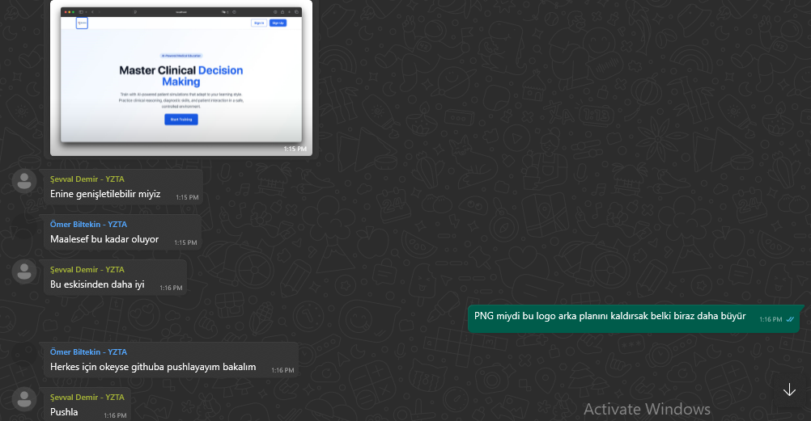

<body>

<!-- HEADER GÖRSELLERİ -->

  

 

<!-- TEAM & PRODUCT NAME -->
<h1><b>Team & Product Name</b></h1>
<h3><b>MediSim</b></h3>

<!-- TEAM MEMBERS TABLE -->
<h2>Information About Team and Product</h2>

<h3>Team Members</h3>
<table>
  <tr>
    <th></th>
    <th>Name</th>
    <th>Title</th>
    <th>Socials</th>
  </tr>

  <!-- Örnek Üye -->
  <tr>
    <td></td>
    <td>Elif Kartal</td>
    <td>Developer</td>
    <td>
      
      
    </td>
  </tr>

  <tr>
    <td></td>
    <td>Emirhan Toprak</td>
    <td>Scrum Master</td>
    <td>
      
      
    </td>
  </tr>

  <tr>
    <td></td>
    <td>Ömer Biltekin</td>
    <td>Developer</td>
    <td>
      
      
    </td>
  </tr>

  <tr>
    <td></td>
    <td>Şevval Demir</td>
    <td>Product Owner</td>
    <td>
      
      
    </td>
  </tr>

  <tr>
    <td></td>
    <td>Umut Sönmez</td>
    <td>Developer</td>
    <td>
      
      
    </td>
  </tr>

  <!-- Diğer ekip üyelerini buraya ekleyebilirsin -->

</table>

<!-- PRODUCT DESCRIPTION -->
<h2>Product Description</h2>

MediSim, tıp öğrencileri için geliştirilen yapay zeka destekli, web tabanlı bir hasta simülasyon platformudur. 
Öğrenciler, sanal hastalar ile etkileşime geçerek vaka analizi yapabilir, teşhis koyabilir ve klinik pratiğe hazırlanabilir. 
LLM teknolojisi ile desteklenen sistem, gerçekçi diyalog ve semptom aktarımı sunar.

<!-- PRODUCT FEATURES -->

<h2>Product Features</h2>

<h3>Virtual Patient Simulation:</h3>

LLM modeli sayesinde sanal hastalar semptomlarını doğal dilde ifade eder, öğrenciler teşhis sürecini yönetir.

<h3>Symptom Sharing and Case Analysis:</h3>

Öğrenciler, hasta semptomlarını okuyup, analiz yaparak olası hastalık tahmininde bulunur.

<h3>Result Validation:</h3>

Sistem, öğrencinin tahminini veritabanındaki vaka bilgileri ile karşılaştırarak geri bildirim sağlar.

<h3>Clinic Selection:</h3>

Farklı klinik senaryolar arasından seçim yapılarak vaka çeşitliliği artırılır.

<h3>Instructor Case Creation (Optional):</h3>

Eğitmenler özel vakalar oluşturabilir, bu sayede sistemdeki vaka havuzu büyür ve LLM geliştirme verisi artar.

<h3>Statistical Dashboard:</h3>

Öğrencilerin başarı durumları, tahmin doğruluk oranları ve genel kullanım istatistikleri dashboard üzerinde takip edilebilir.

<!-- TARGET AUDIENCE -->

<h2>Target Audience</h2>

MediSim'in hedef kitlesi başta tıp fakültesi öğrencileri olmak üzere, klinik eğitmenleri ve medikal eğitimde teknoloji kullanımını artırmak isteyen tüm eğitim kurumlarıdır. Gerçekçi hasta simülasyonu sunarak, öğrencilerin vaka çözüm becerilerini ve klinik düşünme yetkinliklerini artırmayı amaçlar.

<!-- SPRINTS HEADER -->

<!-- SPRINT 1 TEMPLATE -->

<h1>Sprint 1</h1>

<h3>Sprint 1 - App Screenshots</h3>

<table style="width: 100%;">
   <tr>
    <td style="text-align: center;" colspan="3"><h2>Homepage</h2></td>
  </tr>
  <tr>
    <td></td>
  </tr>
  <tr>
    <td style="text-align: center;" colspan="3"><h2>Login & Register Pages</h2></td>
  </tr>
  <tr>
    <td></td>
    <td></td>
  </tr>
  <tr>
    <td colspan="3" style="text-align: center;"><h2>Dashboard & Clinic Selection</h2></td>
  </tr>
  <tr>
    <td></td>
    <td></td>
  </tr>
</table>

<h3>Sprint 1 - Sprint Board </h3>

<h3>Sprint 1 - Daily Scrum Screen Shots </h3>

<ul>
  <li>Proje yönetimi için Trello kullanılacak.</li>
  <li>Projeye uygun UI şablonu yaratmak için bolt.new sitesinden proje tanımıyla birlikte ilk ekranlar oluşturuldu.</li>
  <li>Backend teknolojisi: Node.js + Express</li>
  <li>Frontend: React</li>
  <li>LLM model: Başlangıçta huggingface'ten sağlık alanına özel eğitilmiş hazır modeller kullanılacak, ilerisi için yerel model düşünülüyor.</li>
  <li>Veritabanı: PostgreSQL</li>
  <li>Öğrenci girişi ve kullanıcı doğrulama temel sistem hazırlandı.</li>
</ul>

<b>Expected Point Completion within Sprint:</b> 100 puan  
<b>Point Completion Logic:</b> Proje boyunca toplanması beklenen puan miktarı 300 olarak belirlenmiştir. Her sprint için 100 puan toplayıp projenin yetiştirilmesi hedeflenmektedir. 
<b>Daily Scrum:</b> Ekran görüntüleri veya text dosyası eklenecek  
<b>Product Backlog URL:</b> <a href="https://trello.com/b/pUqcwSsc/yzta-bootcamp" target="_blank">Trello Backlog</a>

<!-- SPRINT REVIEW -->
<h3>Sprint Review:</h3>
<ul>
  <li>Login ve kayıt ekranları tamamlandı.</li>
  <li>Klinik seçim ekranının temel işlevselliği hazır.</li>
  <li>LLM bağlantısı test edildi, API entegrasyonu başladı.</li>
</ul>

<h3>Sprint Review Participants:</h3>

Elif Kartal, Emirhan Toprak, Ömer Biltekin, Şevval Demir, Umut Sönmez

<!-- SPRINT RETROSPECTIVE -->
<h3>Sprint Retrospective:</h3>
<ul>
  <li>Takım içi iletişim ve görev dağılımı başarılıydı.</li>
  <li>LLM entegrasyonu beklenenden zorlu çıktı, ikinci sprintte daha fazla test planlanıyor.</li>
  <li>Veritabanı bağlantısı stabil, veri modelleme üzerine ek çalışmalar yapılacak.</li>
</ul>

</body>

<!-- SPRINT 2 TEMPLATE -->

<h1>Sprint 2</h1>

<h3>App Screenshots</h3>

<table style="width: 100%;">
   <tr>
    <td style="text-align: center;" colspan="3"><h2>Homepage</h2></td>
  </tr>
  <tr>
    <td></td>
  </tr>
  <tr>
    <td style="text-align: center;" colspan="3"><h2>Login & Register Pages</h2></td>
  </tr>
  <tr>
    <td></td>
    <td></td>
  </tr>
  <tr>
    <td colspan="3" style="text-align: center;"><h2>Student Pages</h2></td>
  </tr>
  <tr>
    <td></td>
    <td></td>
    <td></td>
    <td></td>
  </tr>
  <tr>
    <td colspan="3" style="text-align: center;"><h2>Instructor Pages</h2></td>
  </tr>
  <tr>
    <td></td>
    <td></td>
    <td></td>
  </tr>
</table>

<h3>Sprint Board</h3>

<h3>Daily Scrum Kayıtları</h3>

  
  
  
  
  
  
  
  

<h3>Sprint Notları</h3>
<ul>
  <li><strong>Gemini LLM Entegrasyonu:</strong> Yapay zeka sohbet botu başarıyla sisteme entegre edildi. Kullanıcılar web arayüzü üzerinden gerçek zamanlı etkileşim kurabiliyor.</li>
  <li><strong>Arayüz İyileştirmeleri:</strong>
    <ul>
      <li>Ana sayfa modern bir tasarımla yenilendi</li>
      <li>Yeni logo ve ikonlarla görsel kimlik güçlendirildi</li>
      <li>Giriş/Kayıt sayfalarındaki hatalar giderildi</li>
    </ul>
  </li>
  <li><strong>Veritabanı Optimizasyonu:</strong> Ekip üyeleri daha aşina olduğu için PostgreSQL'den SQLite'a geçildi.</li>
  <li><strong>Eğitmen Paneli:</strong> Eğitmen olarak oturum açmış kullanıcılara özel dashboard üzerinden yeni vaka oluşturma özelliği eklendi</li>
</ul>

<b>Expected Point Completion within Sprint:</b> 100 puan  
<b>Point Completion Logic:</b> Puanlama mantığı ilk sprint'te belirlendiği gibidir ve bu sprint'te de hedeflenen puana ulaşılmıştır. 

<h3>Product Backlog URL:</h3>

<a href="https://trello.com/b/pUqcwSsc/yzta-bootcamp" target="_blank">Trello Backlog</a>

<h3>Sprint Review</h3>
<ul>
  <li>Gemini API bağlantısı başarıyla gerçekleştirildi</li>
  <li>Arayüzde kullanılmayacak yerler kaldırıldı</li>
  <li>Veri tabanı teknolojisinde değişiklik kararı alındı</li>
</ul>

<h3>Sprint Review Katılımcıları:</h3>

Elif Kartal, Emirhan Toprak, Ömer Biltekin, Şevval Demir, Umut Sönmez

<h3>Sprint Retrospective</h3>
<ul>
  <li><strong>İyi Yönler:</strong> Takım içi iletişim ve görev dağılımı verimliydi</li>
  <li><strong>Geliştirilecek Alanlar:</strong> Entegrasyon testleri için daha fazla zaman ayrılmalı</li>
  <li><strong>Önemli Çıkarımlar:</strong> SQLite geçişi beklenenden hızlı tamamlandı</li>
</ul>

  <!-- SPRINT 3 TEMPLATE -->
  

<h1>Sprint 3</h1>

<h3>Sprint 3 - App Screenshots</h3>

Uygulamanın bu sprintte gelişen ekranları aşağıda başlıklar halinde gösterilmiştir.

<h4>1. Ana Sayfa ve Giriş Ekranı</h4>

<h4>2. Klinik Seçim ve Vaka Başlatma</h4>

<h3>Sprint Board</h3>

<h3>Daily Scrum Kayıtları</h3>

<h3>Sprint Notları</h3>
<ul>
  <li><strong>Latince-İngilizce Terim Çeviri Özelliği Eklendi:</strong> Doktorlarımız ve doktor adaylarımızın latincede öğrendikleri kelimeleri ara ara hatırlamak isterlerse bilgi tazeleme yapabilecekleri "Medicine Terms" sayfası eklendi.</li>
  <li><strong>Arayüz İyileştirmeleri:</strong>
    <ul>
      <li>Öğrenci ana sayfasında kullanılmayan özellikler kaldırıldı</li>
      <li>Öğrenci ana sayfasında çalışmayan tuşların işlevleri ayarlandı</li>
      <li>Eğitmen sayfasında kullanılmayan özellikler kaldırıldı</li>
      <li>Hem eğitmen hem de öğrenci sayfasına sağlıkla ilgili özlü söz gösterilen bir alan eklendi</li>
    </ul>
  </li>
  <li><strong>Veritabanı Optimizasyonu:</strong> Frontend ve Backend arasındaki bağlantı sorunları giderildi ve gerekli kısımlar veri tabanına bağlandı</li>
  <li><strong>Örnek Veriler Eklendi:</strong> Hasta durumuyla ilgili örnek veriler oluşturuldu ve veri tabanına eklendi</li>
</ul>

  <h4>Gelecek Planları</h4>
  

    
Bu sprintin sonunda gelecek dönemler için bir yol haritası oluşturduk. Öncelikli modülleri belirleyerek geliştirme sürelerini planladık ve uzun vadeli hedeflerimizi gözden geçirdik. Yaptığımız bu çalışmalarla sistemimizin hem teknik altyapısını güçlendirdik hem de kullanıcı deneyimini önemli ölçüde iyileştirdik.

  

<b>Expected Point Completion within Sprint:</b> 100 puan  
<b>Point Completion Logic:</b> Puanlama mantığı ilk sprint’te belirlendiği gibidir ve bu sprint’te de hedeflenen puana ulaşılmıştır.

<h3>Product Backlog URL:</h3>

<a href="https://trello.com/b/pUqcwSsc/yzta-bootcamp" target="_blank">Trello Backlog</a>

<h3>Sprint Review Katılımcıları:</h3>

Elif Kartal, Emirhan Toprak, Ömer Biltekin, Şevval Demir, Umut Sönmez

<h3>Sprint Retrospective</h3>
<ul>
  <li><strong>İyi Yönler:</strong> Takım içi iletişim oldukça güçlüydü. Bu sayede beklenmeyen problemlere hızlı karşılık verilebildi.</li>
  <li><strong>Kötü Yönler:</strong> Tüm takım üyelerinin yoğunluk dönemine geldiği için beklenmedik aksamalar yaşandı.</li> 
  <li><strong>Önemli Çıkarımlar:</strong> Gelecekte kimlerin ne zaman çalışabileceği daha iyi planlanabilir. Özellikle önceden bilinen yoğunluklar varsa bu yoğunluklar daha iyi bir şekilde planlanabilir. </li>
</ul>

<!-- MEDISIM UYGULAMA TANITIMI -->
<h1><b>MediSim - Uygulama Tanıtımı</b></h1>

<!-- Kapak Görseli -->

<!-- Video Linki -->

🎬 <a href="readmeFiles/demo/medisim-demo.mp4" target="_blank">Tanıtım Videosunu İzlemek İçin Tıklayın</a>

<h2>📱 Uygulama Ekran Görüntüleri</h2>
<ol>
  <li>
    <b>Ana Sayfa:</b>
     
    
  </li>
  <li>
    <b>Klinik Seçimi ve Vakalar:</b>
     
    
  </li>
  <!-- Dİğer ekran görüntülerini de ekleriz busaya -->
</ol>

<h2><b>Nasıl Çalıştırılır?</b></h2>

<ol>
  <li><b>Projeyi Klonlayın:</b>
    <pre><code>git clone https://github.com/YZTA-Bootcamp-Group-204/medisim.git</code></pre>
  </li>

  <li><b>Proje dizinine girin:</b>
    <pre><code>cd ProjeDosyalari/MediSim/project</code></pre>
  </li>
  
  <li><b>Gerekli bağımlılıkları yükleyin:</b>
    <pre><code>npm install</code></pre>
  </li>
  
  <li><b>.env dosyasını oluşturun:</b> 
    Package.json ile aynı dizinde şu formatta bir <code>.env</code> dosyası oluşturmalısınız:
    <pre><code>VITE_GEMINI_API_KEY=kendi_api_keyiniz</code></pre>
    <small>API anahtarınızı <a href="https://aistudio.google.com/app/apikey" target="_blank">Google AI Studio</a>'dan ücretsiz alabilirsiniz.</small>
  </li>
  
<li>
  <b>Uygulamayı Başlatın</b> 
  Komutu çalıştırdıktan sonra, terminalde görünen port numarası üzerinden uygulamanın front-end arayüzüne erişim sağlayabilirsiniz.
  

    <pre><code>npm run dev</code></pre>
  

</li>

  

  <li><b>Backend'i Başlatın:</b>
    <ol type="a">
      <li><b>Backend dizinine geçin:</b>
        <pre><code>cd backend</code></pre>
      </li>
      <li><b>Gerekli bağımlılıkları yükleyin:</b>
        <pre><code>npm install</code></pre>
      </li>
      <li><b>Backend sunucusunu başlatın:</b>
        <pre><code>npm start</code></pre>
      </li>
    </ol>
  </li>
</ol>

